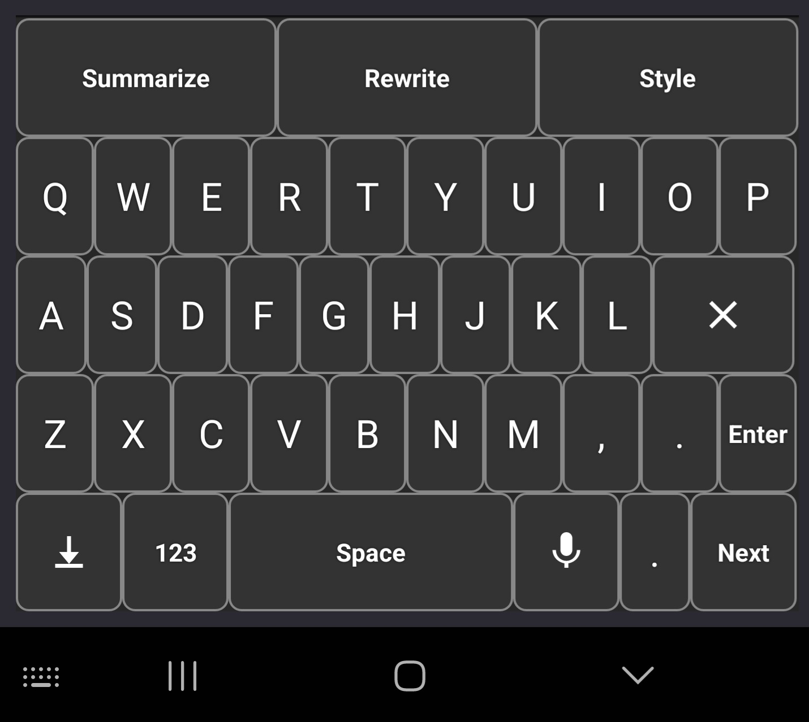

# aikeyboard
A customizable AI-powered keyboard for Android and iOS devices, providing a range of features and actions based on user prompts.

**Preview:**

**Features:**

1. **Fully customizable**: Users can add or remove features and actions based on their needs.
2. **Action buttons**: Display customizable action buttons, such as:
	* Summarize
	* Rewrite
	* Reply
	* Search
	* Speech-to-text (optional)
3. **OpenAI-compatible API server**: Users can change the API server to use different AI models or services.
4. **Cross-platform support**: Compatible with Android and iOS devices.
